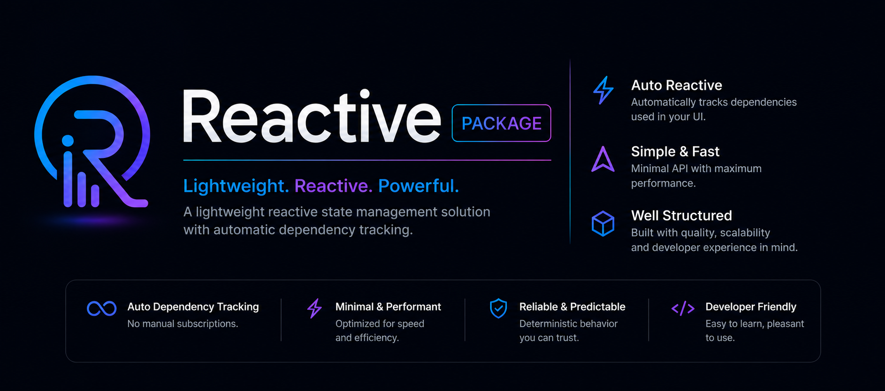

<p align="center">
  
</p>

- [About](#about)
- [Features](#features)
- [Installation](#installation)
- [Reactive State](#reactive-state)
  - [Create Reactive Values](#create-reactive-values)
  - [Reading Values](#reading-values)
  - [Updating Values](#updating-values)
  - [Silent Updates](#silent-updates)
- [Watch Widget](#watch-widget)
  - [Basic Example](#basic-example)
  - [Multiple Reactive Dependencies](#multiple-reactive-dependencies)
  - [Conditional Tracking](#conditional-tracking)
  - [Nested Watch Example](#nested-watch-example)
- [Dependency Injection](#dependency-injection)
  - [Register Singleton](#register-singleton)
  - [Register Transient](#register-transient)
  - [Check Registration](#check-registration)
  - [Reset Singleton](#reset-singleton)
  - [Unregister Dependency](#unregister-dependency)
  - [Clear All Dependencies](#clear-all-dependencies)
- [Page-Based Pagination](#page-based-pagination)
  - [Initialize Pagination](#initialize-pagination)
  - [Refresh Pagination](#refresh-pagination)
  - [Load More](#load-more)
  - [Watch Pagination State](#watch-pagination-state)
  - [Scroll Pagination Example](#scroll-pagination-example)
- [Cursor-Based Pagination](#cursor-based-pagination)
  - [PaginationResult](#paginationresult)
  - [Cursor Pagination State](#cursor-pagination-state)
- [Architecture](#architecture)
- [Performance](#performance)
- [Comparison](#comparison)
- [Advanced Examples](#advanced-reactive-example)
- [Unit Testing](#unit-testing-example)
- [FAQ](#faq)
- [Roadmap](#roadmap)
- [Contributing](#contributing)
- [Changelog](#changelog)
- [License](#license)

---

# About

A lightweight auto-tracking reactive state management library for Flutter.

`reactive_flutter` provides:

- Reactive state containers
- Automatic widget rebuild tracking
- Lightweight dependency injection
- Page-based pagination
- Cursor-based pagination
- Minimal boilerplate
- Zero code generation

---

# Features

✅ Automatic dependency tracking  
✅ Lightweight and fast  
✅ No `BuildContext` required for state access  
✅ No manual dependency lists  
✅ Page-based pagination  
✅ Cursor-based pagination  
✅ Simple dependency injection  
✅ Easy to learn and use  

---

# Installation

Add the package to your `pubspec.yaml`:

```yaml
dependencies:
  reactive_flutter: latest_version
```

Then run:

```bash
flutter pub get
```

Import the package:

```dart
import 'package:reactive_flutter/reactive_flutter.dart';
```

---

# Reactive State

`Reactive<T>` is a lightweight reactive value holder.

Whenever the value changes, widgets that depend on it automatically rebuild.

## Create Reactive Values

```dart
final Reactive<int> counter = Reactive<int>(0);
final Reactive<String> title = Reactive<String>('Flutter');
final Reactive<bool> isDark = Reactive<bool>(false);
```

---

# Reading Values

Use `.value` to access the current value.

```dart
print(counter.value);
```

---

# Updating Values

Update the value using `.value`.

```dart
counter.value = counter.value + 1;

isDark.value = true;
```

---

# Silent Updates

Use `setSilent()` to update a value without notifying listeners.

```dart
counter.setSilent(100);
```

---

# Watch Widget

`Watch` automatically rebuilds whenever a reactive value used inside the builder changes.

No dependency list is required.

## Basic Example

```dart
Watch(
  builder: () {
    return Text('${counter.value}');
  },
)
```

---

# Multiple Reactive Dependencies

```dart
Watch(
  builder: () {
    return Column(
      children: [
        Text('${counter.value}'),
        Text(title.value),
        Switch(
          value: isDark.value,
          onChanged: (value) {
            isDark.value = value;
          },
        ),
      ],
    );
  },
)
```

---

# Conditional Tracking

Dependencies are tracked automatically based on what is accessed during build.

```dart
Watch(
  builder: () {
    return isDark.value
        ? Text('Dark Mode')
        : Text('Light Mode');
  },
)
```

Only the reactive values used in the active branch are subscribed.

---

# Dependency Injection

`ReactiveInjector` is a lightweight service locator.

Supports:

- Singleton registration
- Transient registration
- Dependency lookup
- Reset
- Unregister
- Clear all

---

# Register Singleton

Singletons reuse the same instance.

```dart
ReactiveInjector.singleton<ApiService>(
  () => ApiService(),
);
```

Retrieve the dependency:

```dart
final ApiService api = ReactiveInjector.find<ApiService>();
```

---

# Register Transient

Transient dependencies create a new instance every time.

```dart
ReactiveInjector.transient<UserRepository>(
  () => UserRepository(),
);
```

---

# Check Registration

```dart
final bool exists = ReactiveInjector.isRegistered<ApiService>();
```

---

# Reset Singleton

Clears the cached singleton instance.

```dart
ReactiveInjector.reset<ApiService>();
```

---

# Unregister Dependency

```dart
ReactiveInjector.unregister<ApiService>();
```

---

# Clear All Dependencies

```dart
ReactiveInjector.clear();
```

---

# Page-Based Pagination

`ReactivePagination<T>` helps manage paginated APIs using page numbers.

## Create Pagination Controller

```dart
final ReactivePagination<User> pagination = ReactivePagination<User>(
  perPage: 20,
  fetcher: (page, perPage) async {
    return api.fetchUsers(page, perPage);
  },
);
```

---

# Initialize Pagination

```dart
await pagination.init();
```

---

# Refresh Pagination

```dart
await pagination.refresh();
```

---

# Load More

```dart
await pagination.fetchMore();
```

---

# Access Pagination State

```dart
pagination.items
pagination.isLoading
pagination.isMoreLoading
pagination.hasMore
pagination.error
pagination.totalFetched
pagination.isEmpty
```

---

# Watch Pagination State

```dart
Watch(
  builder: () {
    if (pagination.isLoading) {
      return const CircularProgressIndicator();
    }

    return ListView.builder(
      itemCount: pagination.items.length,
      itemBuilder: (context, index) {
        final user = pagination.items[index];

        return ListTile(
          title: Text(user.name),
        );
      },
    );
  },
)
```

---

# Cursor-Based Pagination

`ReactiveCursorPagination<T, C>` supports APIs that use cursors.

`C` represents the cursor type.

Examples:

- `String`
- `int`
- `DateTime`
- `DocumentSnapshot` (Firebase Firestore)
- Custom cursor model

---

# Create Cursor Pagination

```dart
final ReactiveCursorPagination<User, String> pagination =
    ReactiveCursorPagination<User, String>(
  perPage: 20,
  fetcher: (perPage, cursor) async {
    return api.fetchUsers(perPage, cursor);
  },
);
```

---

# PaginationResult

Cursor pagination fetchers return `PaginationResult<T, C>`.

```dart
PaginationResult<User, String>(
  items: users,
  nextCursor: nextCursor,
)
```

---

# Cursor Pagination State

```dart
pagination.items
pagination.cursor
pagination.isLoading
pagination.isMoreLoading
pagination.hasMore
pagination.error
pagination.totalFetched
pagination.isEmpty
```

---

# Example App

```dart
import 'package:flutter/material.dart';
import 'package:reactive_flutter/reactive_flutter.dart';

final Reactive<int> counter = Reactive<int>(0);

void main() {
  runApp(const MyApp());
}

class MyApp extends StatelessWidget {
  const MyApp({super.key});

  @override
  Widget build(BuildContext context) {
    return MaterialApp(
      home: Scaffold(
        appBar: AppBar(
          title: const Text('Reactive State'),
        ),
        body: Center(
          child: Watch(
            builder: () {
              return Text(
                '${counter.value}',
                style: const TextStyle(fontSize: 40),
              );
            },
          ),
        ),
        floatingActionButton: FloatingActionButton(
          onPressed: () {
            counter.value++;
          },
          child: const Icon(Icons.add),
        ),
      ),
    );
  }
}
```

---

# API Overview

## Reactive

| Function | Description |
|---|---|
| `value` | Get or update the reactive value |
| `setSilent()` | Update value without notifying listeners |
| `toString()` | Returns debug string |

---

## Watch

| Property | Description |
|---|---|
| `builder` | Widget builder automatically tracked |

---

## ReactiveInjector

| Function | Description |
|---|---|
| `singleton()` | Register singleton dependency |
| `transient()` | Register transient dependency |
| `find()` | Resolve dependency |
| `isRegistered()` | Check if dependency exists |
| `reset()` | Reset singleton instance |
| `unregister()` | Remove dependency |
| `clear()` | Remove all dependencies |

---

## ReactivePagination

| Function | Description |
|---|---|
| `init()` | Load first page |
| `refresh()` | Reload from beginning |
| `fetchMore()` | Load next page |

---

## ReactiveCursorPagination

| Function | Description |
|---|---|
| `init()` | Load first page |
| `refresh()` | Reload from beginning |
| `fetchMore()` | Load next cursor page |

---

# Why reactive_flutter?

`reactive_flutter` focuses on simplicity.

Unlike larger state management solutions, it provides:

- Minimal API surface
- Automatic dependency tracking
- No boilerplate
- No generators
- No annotations
- Lightweight architecture
- Easy integration into existing apps

Perfect for:

- Small apps
- Medium apps
- Prototypes
- Utility apps
- Feature modules
- Developers who prefer minimalism

---

# Performance

`reactive_flutter` is designed to stay lightweight and fast.

## Why it performs well

- No reflection
- No code generation
- No runtime dependency graph building
- Fine-grained rebuild tracking
- Only widgets that access a reactive value rebuild
- Conditional dependencies are handled automatically

---

# Architecture

```text
Reactive<T>
    ↓
ReactiveTracker
    ↓
Watch Widget
    ↓
Automatic Rebuild
```

## How it works

1. `Watch` starts dependency tracking.
2. Any accessed `Reactive.value` registers itself.
3. `Watch` subscribes only to accessed reactives.
4. When a reactive changes, only subscribed widgets rebuild.

---

# Comparison

| Feature | reactive_flutter | GetX | Riverpod | Provider |
|---|---|---|---|---|
| Auto tracking | ✅ | ⚠️ Partial | ❌ | ❌ |
| Code generation | ❌ | ❌ | ⚠️ Optional | ❌ |
| Boilerplate | Very Low | Low | Medium | Medium |
| Dependency injection | ✅ | ✅ | ❌ | ❌ |
| Pagination helpers | ✅ | ❌ | ❌ | ❌ |
| Learning curve | Easy | Easy | Medium | Easy |
| Lightweight | ✅ | ⚠️ | ⚠️ | ✅ |

---

# Advanced Reactive Example

```dart
final Reactive<List<String>> todos = Reactive<List<String>>([]);

void addTodo(String value) {
  todos.value = [...todos.value, value];
}

void removeTodo(String value) {
  todos.value = todos.value.where((e) => e != value).toList();
}
```

---

# Nested Watch Example

```dart
Watch(
  builder: () {
    return Column(
      children: [
        Watch(
          builder: () {
            return Text(counter.value.toString());
          },
        ),
        Watch(
          builder: () {
            return Text(title.value);
          },
        ),
      ],
    );
  },
)
```

---

# Scroll Pagination Example

```dart
class UsersPage extends StatefulWidget {
  const UsersPage({super.key});

  @override
  State<UsersPage> createState() => _UsersPageState();
}

class _UsersPageState extends State<UsersPage> {
  final ScrollController _controller = ScrollController();

  final ReactivePagination<User> pagination = ReactivePagination<User>(
    perPage: 20,
    fetcher: (page, limit) async {
      return api.fetchUsers(page, limit);
    },
  );

  @override
  void initState() {
    super.initState();

    pagination.init();

    _controller.addListener(() {
      if (_controller.position.pixels >=
          _controller.position.maxScrollExtent - 200) {
        pagination.fetchMore();
      }
    });
  }

  @override
  Widget build(BuildContext context) {
    return Watch(
      builder: () {
        return ListView.builder(
          controller: _controller,
          itemCount: pagination.items.length,
          itemBuilder: (context, index) {
            final user = pagination.items[index];

            return ListTile(
              title: Text(user.name),
            );
          },
        );
      },
    );
  }
}
```

---

# Unit Testing Example

```dart
void main() {
  test('Reactive value updates correctly', () {
    final Reactive<int> counter = Reactive<int>(0);

    counter.value = 5;

    expect(counter.value, 5);
  });
}
```

---

# Dependency Injection Example

```dart
class ApiService {
  String get title => 'Reactive State';
}

void setupDependencies() {
  ReactiveInjector.singleton<ApiService>(
    () => ApiService(),
  );
}

final ApiService api = ReactiveInjector.find<ApiService>();
```

---

# FAQ

## Does this use code generation?

No. `reactive_flutter` works without generators or build_runner.

---

## Does Watch rebuild the whole app?

No.

Only widgets subscribed to changed reactive values rebuild.

---

## Can I use it with existing architectures?

Yes.

You can integrate it with:

- Clean Architecture
- MVVM
- MVC
- Feature-first architecture
- Existing Provider/Riverpod/GetX apps

---

## Does it support async state?

Yes.

You can store Futures, async results, pagination state, and API responses inside reactive values.

---

## Is it production ready?

Yes.

The library is designed to be lightweight, predictable, and suitable for production applications.

---

# Roadmap

- [ ] Computed reactive values
- [ ] Reactive collections
- [ ] DevTools integration
- [ ] Async reactive helpers
- [ ] Stream bindings
- [ ] Form utilities
- [ ] Persistent storage helpers
- [ ] Flutter Web optimizations

---

# Contributing

Contributions are welcome.

## Setup

```bash
git clone <repository>
cd reactive_flutter
flutter pub get
```

## Run Tests

```bash
flutter test
```

## Format Code

```bash
dart format .
```

---

# Badges

Add these badges to the top of your README after publishing:

```md
[](https://pub.dev/packages/reactive_flutter)
[](https://pub.dev/packages/reactive_flutter/score)
[](https://pub.dev/packages/reactive_flutter/score)
[](https://pub.dev/packages/reactive_flutter/score)
```

---

# License

MIT License

